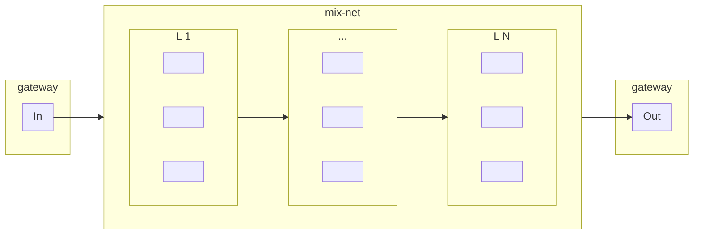

## Network Data Flow

The Gateway:

- receives incoming data streams and packetizes them into messages for the mix-net
- serves messages for mix-net clients to retrieve and send through the mix-net
- receives messages leaving the mix-net
- serves outgoing data streams reassembled from mix-net messages

