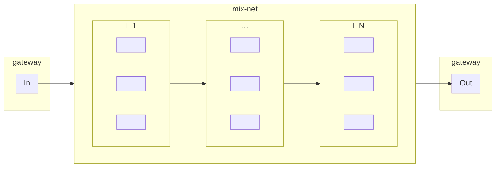

# 0KN

## xtrellis

A single executable to launch mix-net components including coordinator, servers, clients, and gateway.

## Prerequisites

Install the following:

- latest stable version of [go](https://go.dev/doc/install) (`>= 1.21.1`)
- all [Trellis dependencies](/README.md#dependencies)
- [Protocol Buffer Compiler](https://grpc.io/docs/protoc-installation/)
- [Buf](https://buf.build/docs/installation)

Utilities used by test scripts:

- netcat
- wget

## Build

Generate code from protocol buffers:

```sh
cd pb && go mod download && go mod verify
buf generate
```

Build `xtrellis` exe:

```sh
go mod download && go mod verify
cd cmd/xtrellis
go install && go build
```

## Test Gateway

Run a coordinated local mix-net:

```sh
cd cmd/xtrellis
./bin/run-coordinator-gateway.sh
```

Send `100KB` random data through the mix-net and compare data in to data out:

```sh
./bin/test-gateway-io.sh 102400;
```

Pipe generic data through the mix-net:

```sh
cat in.png | ./bin/test-gateway-pipe.sh > out.png
```

### With Docker Compose

From project root:

```sh
# build container
docker compose --profile test-gateway build

# run gateway test
docker compose --profile test-gateway up

# remove container
docker compose --profile test-gateway down
```

## Network Data Flow

The Gateway:

- receives incoming data streams and packetizes them into messages for the mix-net
- serves messages for mix-net clients to retrieve and send through the mix-net
- receives messages leaving the mix-net
- serves outgoing data streams reassembled from mix-net messages


