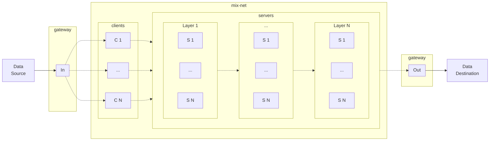

# 0KN

## Architecture

The following structure represents a map for current development and will evolve for underlying Trellis constructs to operate within the decentralized self-organizing Zero-Knowledge Network.

### Data Flow

### Mix-Net

#### Gateways

- receive incoming data streams and packetizes them into messages of identitical size and characteristics for transmission through the mix-net
- serve messages for mix-net clients to retrieve and send through the mix-net
- if no stream data is in queue for transmission, dummy messages are given to clients to transmit
- receive messages leaving the mix-net
- serve outgoing data streams reassembled from mix-net messages

#### Clients

- retrieve messages from a gateway and send to servers, as coordinated in time by the coordinator

#### Servers

- are arranged in multiple layers, receive messages from clients, and send to a server in the next layer, as coordinated in time by the coordinator

#### Coordinator

- conducts the lifecycle and timing of message transmission rounds

## Protocol

### Mix-Net Message

- mix-net messages have identical size within rounds of a coordination
- incoming stream data is packetized with an informational header and optional payload

#### Message Format

|       element        | type (bytes) |
| :------------------: | :----------: |
| packet header length |  uint16 (2)  |
|  packet header data  |   variable   |
|     data length      |  uint32 (4)  |
|         data         |   variable   |

#### Packet Header

| key       | description                    |
| --------- | ------------------------------ |
| type      | packet type                    |
| stream id | data stream unique identifier  |
| sequence  | packet order within the stream |

##### Packet Types

| type      | usage                           |
| --------- | ------------------------------- |
| `UNKNOWN` | undefined                       |
| `START`   | new stream transmission         |
| `DATA`    | stream data                     |
| `END`     | stream transmission is complete |
| `ERROR`   | stream transmission failure     |
| `DUMMY`   | mix-net message filler          |
