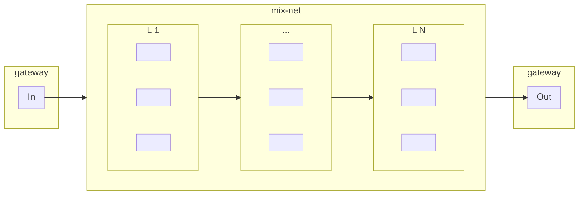

# 0KN

## Architecture

### Gateway

- receives incoming data streams and packetizes them into messages for the mix-net
- serves messages for mix-net clients to retrieve and send through the mix-net
- receives messages leaving the mix-net
- serves outgoing data streams reassembled from mix-net messages

## Protocol

### Mix-Net Message

- mix-net messages have identical size within rounds of a coordination
- incoming stream data is packetized with an informational header and optional payload

#### Message Format

|       element        | type (bytes) |
| :------------------: | :----------: |
| packet header length |  uint16 (2)  |
|  packet header data  |   variable   |
|     data length      |  uint32 (4)  |
|         data         |   variable   |

#### Packet Header

| key       | description                    |
| --------- | ------------------------------ |
| type      | packet type                    |
| stream id | data stream unique identifier  |
| sequence  | packet order within the stream |

##### Packet Types

| type      | usage                           |
| --------- | ------------------------------- |
| `UNKNOWN` | undefined                       |
| `START`   | new stream transmission         |
| `DATA`    | stream data                     |
| `END`     | stream transmission is complete |
| `ERROR`   | stream transmission failure     |
| `DUMMY`   | mix-net message filler          |
