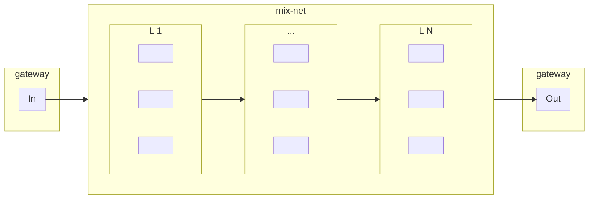

# 0KN

## xtrellis

A single executable to launch mix-net components including coordinator, servers, clients, and gateway.

## Prerequisites

Install the following:

- latest stable version of [go](https://go.dev/doc/install) (`>= 1.21.1`)
- [Protocol Buffer Compiler](https://grpc.io/docs/protoc-installation/)
- [Buf](https://buf.build/docs/installation)
- [Trellis dependencies](/README.md#dependencies)
  - except for "_go files_", which we'll build after `pb/` (see below)

Utilities used by test scripts:

- netcat
- wget

## Build

Generate code from protocol buffers:

```sh
cd pb && go mod download && go mod verify
buf generate
cd ..
```

Build trellis `server`, `client`, `coordinator`:

```sh
go mod download && go mod verify
cd cmd/server && go install && go build
cd ../client && go install && go build
cd ../coordinator && go install && go build
```

Build `xtrellis`:

```sh
cd ../xtrellis
go install && go build
```

## Test Gateway

From the xtrellis directory `cmd/xtrellis/`,

Run a coordinated local mix-net with gateway enabled, for example:

```sh
./xtrellis coordinator --gatewayenable --debug
```

Then, in a separate terminal:

Send `100KB` random data through the mix-net and compare data in to data out:

```sh
./bin/test-gateway-io.sh 102400
```

Pipe generic data through the mix-net:

```sh
cat in.png | ./bin/test-gateway-pipe.sh > out.png
```

### With Docker Compose

From project root:

```sh
# build and run container for gateway test
docker compose --profile test-gateway up --build

# remove container
docker compose --profile test-gateway down
```

## Architecture & Protocol

### Gateway

- receives incoming data streams and packetizes them into messages for the mix-net
- serves messages for mix-net clients to retrieve and send through the mix-net
- receives messages leaving the mix-net
- serves outgoing data streams reassembled from mix-net messages



### Mix-Net Message

- mix-net messages have identical size within rounds of a coordination
- incoming stream data is packetized with an informational header and optional payload

#### Message Format

|       element        | type (bytes) |
| :------------------: | :----------: |
| packet header length |  uint16 (2)  |
|  packet header data  |   variable   |
|     data length      |  uint32 (4)  |
|         data         |   variable   |

#### Packet Header (protobuf)

|  element  |          description           |
| :-------: | :----------------------------: |
|   type    |          packet type           |
| stream id | data stream unique identifier  |
| sequence  | packet order within the stream |
